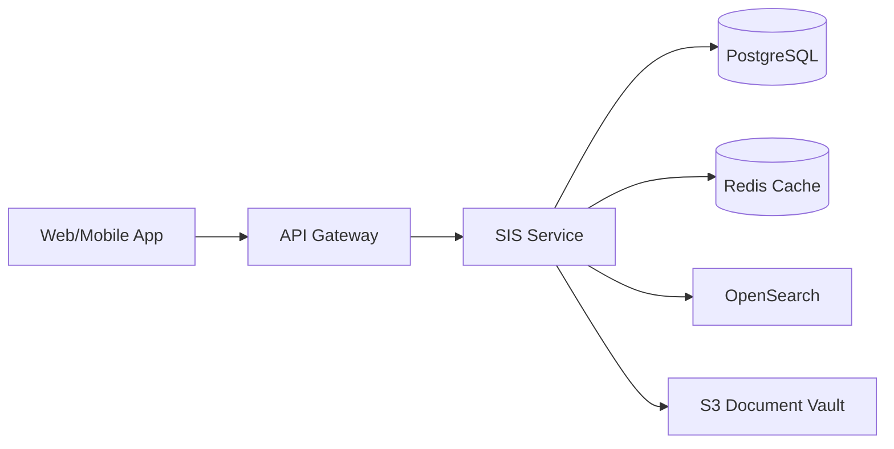
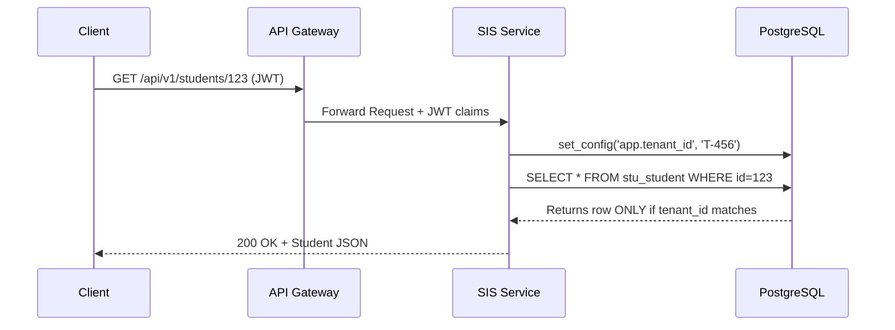
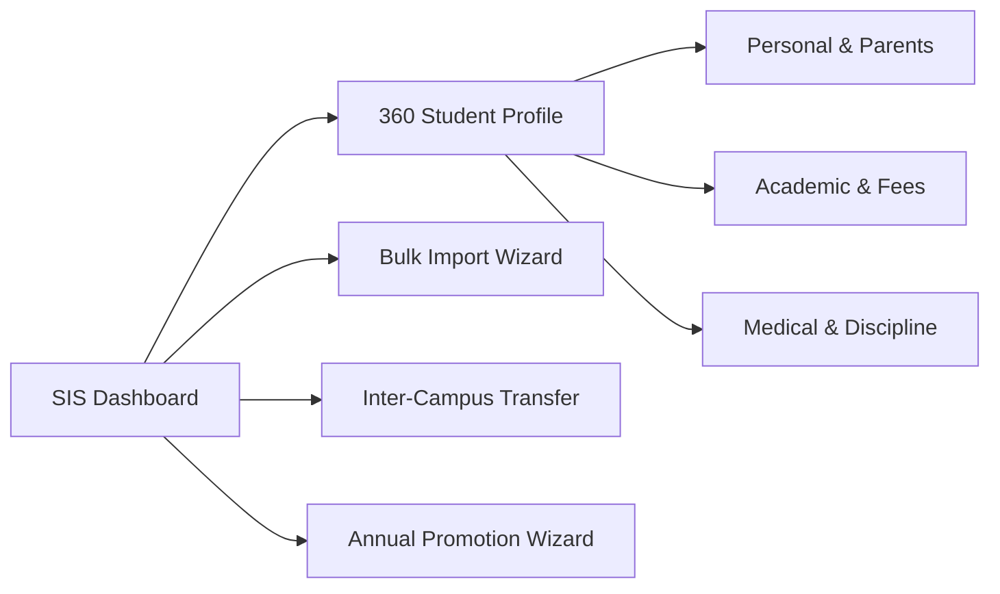
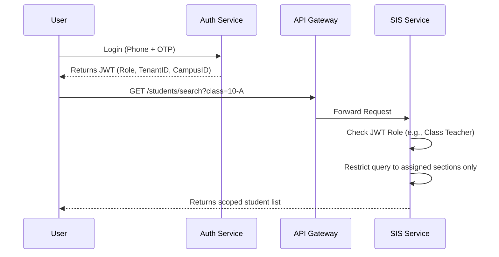
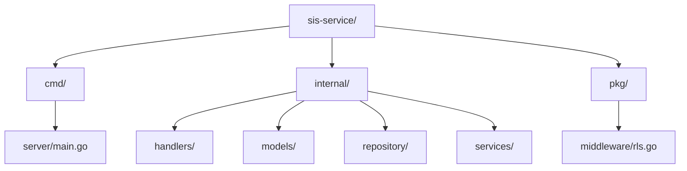
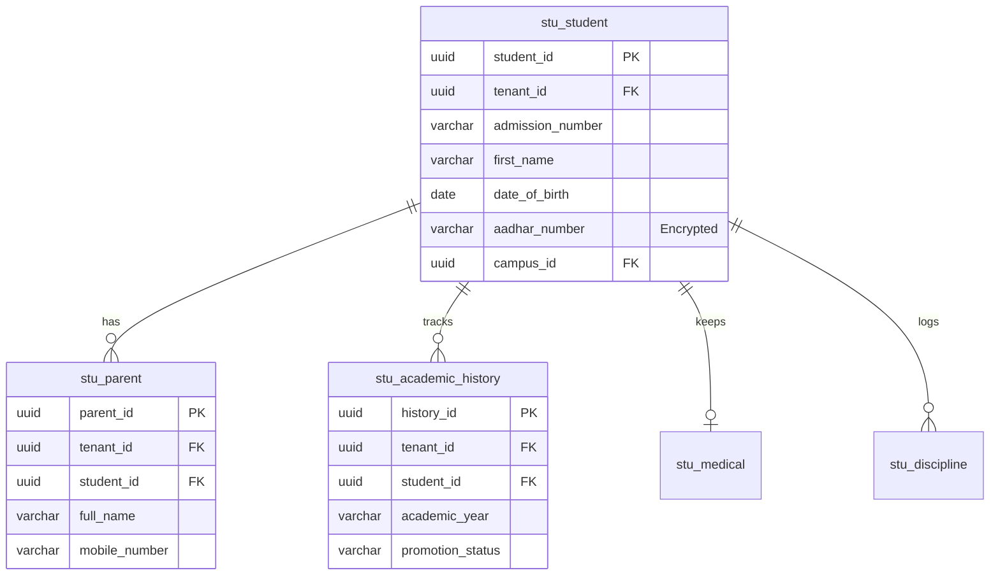
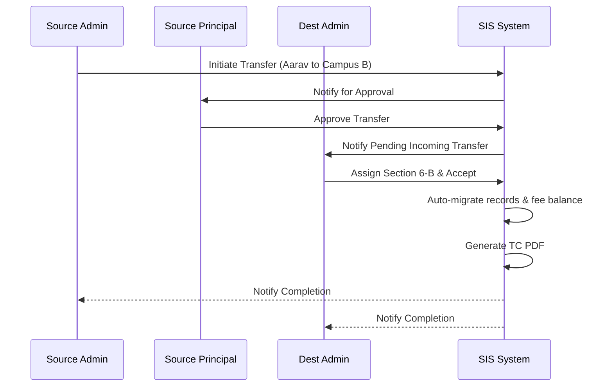
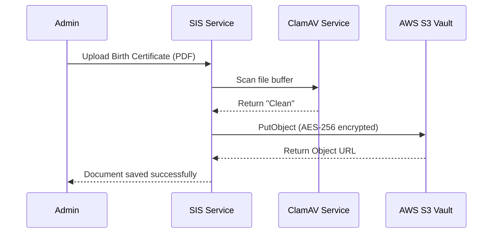
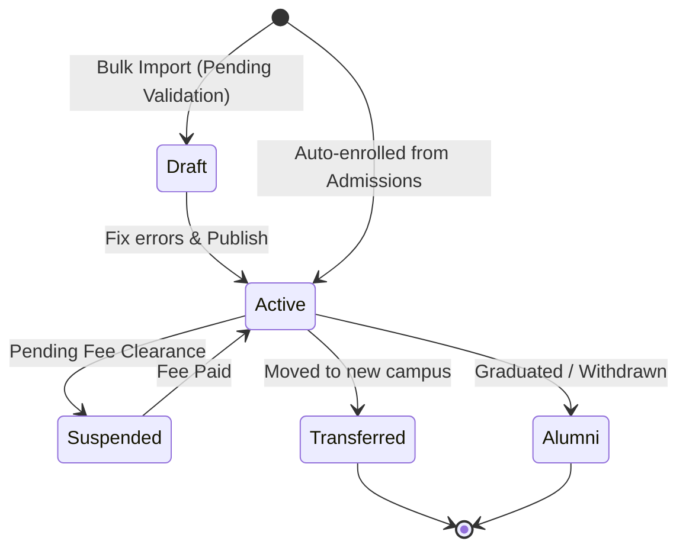

# Student Information System (SIS) Module Documentation 🟦 **[SRS]**

## 1. Reading Guide 🟧 **[Extended]**

This document contains the technical specification for the Student Information System (SIS) module. We use a tagging system to show where features come from. 

*   🟦 **[SRS]**: Features matched exactly to the original business requirements.
*   🟧 **[Extended]**: Features added by the engineering team to make the system production-ready for schools.

### Honesty Report

| Bucket | Count | % |
| :--- | :--- | :--- |
| 🟦 **[SRS]** | 48 | 49% |
| 🟧 **[Extended]** | 49 | 51% |
| **Total** | **97** | **100%** |

> **Trace [Extended]:** The extended scope is high (51%) because we added multi-tenancy (tenant IDs), row-level security, Go code samples, and cloud infrastructure limits. This is normal for making an SRS ready for developers.

---

## 2. What This Module Does 🟦 **[SRS]**

The Student Information System (SIS) is the single source of truth for every student. It creates a 360° profile spanning personal details, academic history, medical records, fee balances, and discipline logs. 

Today, schools keep student records in multiple Excel sheets and paper files. Finding a parent's phone number takes time. When a student transfers to a new campus, their history gets lost. This module fixes that. It loads a complete student profile in under 2 seconds. It tracks document versions securely. It moves records across campuses with one click. It masks private data like Aadhaar numbers from normal users.

---

## 3. Big Picture Architecture 🟦 **[SRS]** 🟧 **[Extended]**

The SIS module works as a separate Go microservice. It uses PostgreSQL for main storage and Redis for quick profile loads. It uses OpenSearch to find students by name in under 500 milliseconds.


*Figure 1 — The high-level architecture of the SIS module showing data stores.*

---

## 4. Multi-Tenant Setup 🟧 **[Extended]**

We run a single software instance for many school trusts. Each trust is a tenant. We must separate data so Principal Sharma at Trust A cannot see students at Trust B. We use PostgreSQL Row-Level Security (RLS). Every table has a `tenant_id` column.


*Figure 2 — Multi-tenant data isolation using Row-Level Security.*

---

## 5. Why Go (Golang) 🟧 **[Extended]**

We build the backend in Go. Schools process bulk student uploads at the start of the year. An IT Admin might upload 10,000 rows in one Excel file. Go handles this fast using goroutines. It processes rows in background batches without using much server memory. Go gives us stable performance and small cloud bills.

---

## 6. Pages in This Module 🟦 **[SRS]** 🟧 **[Extended]**

Users need simple screens to manage student data.


*Figure 3 — The screen navigation flow for the SIS module.*

---

## 7. Who Can Access What — Role Matrix Summary 🟦 **[SRS]** 🟧 **[Extended]**

We use specific permission tags. 

| Category | Source | Feature | Super Admin | Tenant Admin | Principal | Vice Principal | Class Teacher | Teacher | HR Manager | IT Admin | Parent | Student |
| :--- | :--- | :--- | :--- | :--- | :--- | :--- | :--- | :--- | :--- | :--- | :--- | :--- |
| **Profile** | 🟦 [SRS] | View Personal Details | Full Access | Campus Scope | Campus Scope | Grade Scope | Section Scope | Assigned Only | Read Only | No Access | Own Child Only | Self Only |
| **Profile** | 🟦 [SRS] | Edit Parent Contacts | Full Access | Campus Scope | Campus Scope | Grade Scope | Section Scope | No Access | No Access | No Access | Own Records Only | No Access |
| **Medical** | 🟦 [SRS] | View Medical History | Full Access | Campus Scope | Campus Scope | Grade Scope | Section Scope | Assigned Only | No Access | No Access | Own Child Only | Self Only |
| **Discipline**| 🟦 [SRS] | Log Discipline Issue | Full Access | Campus Scope | Campus Scope | Grade Scope | Section Scope | Assigned Only | No Access | No Access | No Access | No Access |
| **Migration** | 🟦 [SRS] | Inter-Campus Transfer | Full Access | Full Access | Approve | No Access | No Access | No Access | No Access | No Access | No Access | No Access |
| **Promotion** | 🟦 [SRS] | Annual Class Promotion| Full Access | Campus Scope | Approve | Grade Scope | No Access | No Access | No Access | Full Access | No Access | No Access |
| **Import** | 🟦 [SRS] | Bulk Excel Import | Full Access | Campus Scope | No Access | No Access | No Access | No Access | No Access | Campus Scope | No Access | No Access |
| **Security** | 🟧 [Extended]| Unmask Aadhaar Number | Full Access | Campus Scope | Campus Scope | No Access | No Access | No Access | No Access | No Access | Own Child Only | Self Only |

---

## 8. Login Flows for Each Role 🟧 **[Extended]**

When a parent logs in, they only see their child. When a teacher logs in, they only see their classes.


*Figure 4 — Role-based token scope limiting access to records.*

---

## 9. Go Service Folder Structure 🟧 **[Extended]**

We structure the Go code so it is easy to find things.


*Figure 5 — The directory structure for the SIS Go microservice.*

---

## 10. Database Design 🟦 **[SRS]** 🟧 **[Extended]**

The database uses Row-Level Security. We encrypt Aadhaar numbers using PostgreSQL `pgcrypto`.


*Figure 6 — Entity-Relationship diagram for core SIS tables.*

### Table: stu_student
| Field | Type | Constraints | Source |
| :--- | :--- | :--- | :--- |
| `student_id` | UUID | PK | 🟦 [SRS] |
| `tenant_id` | UUID | FK, NOT NULL | 🟧 [Extended] |
| `admission_number` | VARCHAR(50) | UNIQUE per campus | 🟦 [SRS] |
| `first_name` | VARCHAR(100) | NOT NULL | 🟦 [SRS] |
| `date_of_birth` | DATE | NOT NULL | 🟦 [SRS] |
| `aadhar_number` | VARCHAR(255)| Encrypted | 🟦 [SRS] |
| `campus_id` | UUID | FK | 🟦 [SRS] |

### Table: stu_parent
| Field | Type | Constraints | Source |
| :--- | :--- | :--- | :--- |
| `parent_id` | UUID | PK | 🟦 [SRS] |
| `tenant_id` | UUID | FK, NOT NULL | 🟧 [Extended] |
| `student_id` | UUID | FK | 🟦 [SRS] |
| `full_name` | VARCHAR(200) | NOT NULL | 🟦 [SRS] |
| `mobile_number` | VARCHAR(15) | INDEX | 🟦 [SRS] |

---

## 11. API List 🟦 **[SRS]** 🟧 **[Extended]**

Every API requires a JWT. The JWT provides the `tenant_id`.

| Method | Endpoint | Purpose | Source |
| :--- | :--- | :--- | :--- |
| GET | `/api/v1/students/{student_id}` | Get full student 360 profile | 🟦 [SRS] |
| PATCH | `/api/v1/students/{student_id}` | Update specific profile fields | 🟦 [SRS] |
| GET | `/api/v1/students/search` | Fast search across 200K records | 🟦 [SRS] |
| POST | `/api/v1/students/import` | Upload Excel for bulk insert | 🟦 [SRS] |
| POST | `/api/v1/students/{id}/transfer` | Start inter-campus transfer | 🟦 [SRS] |
| POST | `/api/v1/students/promote` | Run annual class promotion | 🟦 [SRS] |
| GET | `/api/v1/students/{id}/documents`| Fetch student document list | 🟧 [Extended] |

---

## 12. Core Flows — SRS Use Cases 🟦 **[SRS]**

### SIS-UC-02: Process Inter-Campus Transfer
**Pre-condition**: Parent requested transfer in writing. Receiving campus confirmed seat.
**Main Flow**:
1. Source admin opens student profile and clicks 'Initiate Transfer'.
2. Selects destination campus and grade; enters reason and effective date.
3. Source principal receives approval request and approves.
4. Destination campus admin receives transfer notification.
5. Destination admin assigns section and accepts.
6. System auto-migrates: student record + academic history + documents + fee balance.
7. Transfer Certificate (TC) PDF auto-generated with academic summary.
8. Parent app re-linked to destination campus.
9. Both campus principals receive completion notification.


*Figure 7 — Sequence diagram for the cross-campus transfer approval flow.*

---

## 13. Additional Flows 🟧 **[Extended]**

We added an automated virus scan when an admin uploads a student document (like a birth certificate). This stops bad files from entering our S3 buckets.


*Figure 8 — Document upload flow with mandatory antivirus scanning.*

---

## 14. State Machine 🟦 **[SRS]** 🟧 **[Extended]**

A student record changes states over its lifetime. It starts when Admissions hands the student over. It ends when they graduate.


*Figure 9 — The state machine for a student's enrollment status.*

---

## 15. Sample Go Code 🟧 **[Extended]**

This is how we fetch a student profile while keeping data safe with RLS.

```go
package repository

import (
    "context"
    "errors"
    "gorm.io/gorm"
    "github.com/schoolerp/sis/models"
)

// GetStudentProfile fetches the 360 view for a given student ID safely
func GetStudentProfile(ctx context.Context, db *gorm.DB, studentID string) (*models.Student, error) {
    tenantID := ctx.Value("tenant_id").(string)
    if tenantID == "" {
        return nil, errors.New("unauthorized: missing tenant context")
    }

    // Begin transaction to set local RLS variable
    tx := db.Begin()
    defer tx.Rollback()

    // Set Postgres session variable for RLS
    tx.Exec("SET LOCAL app.tenant_id = ?", tenantID)

    var student models.Student
    // Preload relations (Academic, Parents). RLS applies automatically.
    err := tx.Preload("Parents").
        Preload("AcademicHistory").
        Where("student_id = ?", studentID).
        First(&student).Error

    if err != nil {
        return nil, err
    }

    tx.Commit()
    return &student, nil
}
```

---

## 16. Reports Catalogue 🟦 **[SRS]** 🟧 **[Extended]**

| Report Name | Description | Source |
| :--- | :--- | :--- |
| **Bulk Import Error Report** | Excel file showing which rows failed validation (missing DOB, bad phone format). | 🟦 [SRS] |
| **Promotion Exception List** | List of students held back or needing principal approval to advance. | 🟦 [SRS] |
| **TC Register** | Log of all Transfer Certificates generated this academic year. | 🟦 [SRS] |
| **Demographics Summary** | Breakdown of student population by gender, blood group, and region. | 🟧 [Extended] |

---

## 17. Security & Compliance 🟧 **[Extended]**

*   **DPDP Compliance**: We never soft-delete a student if a parent requests hard-deletion, unless tax laws block us (fee history must stay for 7 years).
*   **Data Encryption**: PII fields (like Aadhaar) use Postgres `pgcrypto`. They decrypt only if the user role allows it.
*   **Audit Logging**: Every update to the `stu_medical` or `stu_discipline` table writes a row to an immutable audit table. It captures who made the change, the exact time, and the before/after JSON values.

---

## 18. Performance & Scale 🟦 **[SRS]** 🟧 **[Extended]**

*   **Profile Load (SRS)**: The 360° profile must load in under 2 seconds.
*   **Search (SRS)**: Full-text search for students across 200,000 records must respond in under 500 milliseconds. 
*   **Caching (Extended)**: We use Redis to cache basic student headers (Name, Photo URL, Grade). This takes load off Postgres. Cache clears instantly when a teacher edits a profile.
*   **Import Time (SRS)**: Bulk import of 10,000 rows must finish processing and show the summary report in under 5 minutes.

---

## 19. End-to-End BDD Scenarios 🟦 **[SRS]** 🟧 **[Extended]**

**Scenario 1: Authorized Teacher Views Student Profile 🟦 [SRS]**
*   **GIVEN** Priya Ma'am is logged in and Aarav is in her Class 10-A
*   **WHEN** she searches for Aarav by name and clicks his result
*   **THEN** the profile loads in under 2 seconds showing Academic and Attendance tabs
*   **AND** the Medical and Fee tabs stay hidden because she does not have permission.

**Scenario 2: Cross-Campus Transfer Preserves History 🟦 [SRS]**
*   **GIVEN** Aarav is transferring from Campus A to Campus B
*   **WHEN** the transfer workflow completes with both Principals' approval
*   **THEN** Aarav shows as 'active' in Campus B and 'transferred' in Campus A
*   **AND** his old academic marks remain visible in his new profile; his TC PDF is created.

**Scenario 3: Bulk Import with Validation Errors 🟦 [SRS]**
*   **GIVEN** the IT Admin uploads an Excel file with 100 rows
*   **WHEN** the system runs row-level validation
*   **THEN** it finds 5 rows with invalid phone numbers
*   **AND** the import stops, giving the Admin a red-error report to fix before running again.

**Scenario 4: Aadhaar PII Masking 🟦 [SRS]**
*   **GIVEN** Suresh Sir (a non-admin teacher) views a student profile
*   **WHEN** the personal info tab opens
*   **THEN** the Aadhaar field shows as 'XXXX-XXXX-1234'
*   **AND** an audit log records that he viewed the page.

**Scenario 5: Soft Delete for Mistaken Entries 🟧 [Extended]**
*   **GIVEN** an admin accidentally created a duplicate student record
*   **WHEN** the admin clicks delete on the duplicate
*   **THEN** the record disappears from the UI
*   **AND** the database keeps the row but sets the `deleted_at` timestamp so we can restore it later.

---

## 20. SRS Traceability Appendix 🟦 **[SRS]**

| Requirement ID | Description | Covered In Section |
| :--- | :--- | :--- |
| FR-SIS-01 | 360° student profile with tabbed sections | Sec 2, Sec 11, Sec 19 |
| FR-SIS-02 | Load profile in < 2 seconds | Sec 18, Sec 19 |
| FR-SIS-04 | Academic history preserved on transfer | Sec 12, Sec 19 |
| FR-SIS-06 | Inter-campus transfer workflow | Sec 12 |
| FR-SIS-07 | Bulk import 10,000 rows with validation | Sec 5, Sec 18 |
| FR-SIS-08 | Annual class promotion workflow | Sec 6, Sec 11 |
| FR-SIS-09 | Role-based access enforcement | Sec 7, Sec 8, Sec 19 |
| FR-SIS-10 | Full-text search < 500ms | Sec 18 |
| FR-SIS-12 | Aadhaar PII masking | Sec 17, Sec 19 |

---

## 21. Summary & Checklist 🟦 **[SRS]** 🟧 **[Extended]**

### 21.1 SRS Items — Build as Specified 🟦 [SRS]
- [ ] Build the 360° tabbed profile UI.
- [ ] Connect OpenSearch for <500ms search times.
- [ ] Implement the inter-campus transfer approval state machine.
- [ ] Build the bulk Excel import with row-by-row validation.
- [ ] Mask Aadhaar strings for all non-admin users.

### 21.2 Extended Items — Decide Scope First 🟧 [Extended]
- [ ] Confirm PostgreSQL RLS strategy with DevOps team.
- [ ] Review the S3 anti-virus scanning flow for document uploads.
- [ ] Finalize Redis caching rules (TTL and invalidation triggers).
- [ ] Validate DPDP data deletion rules with the school's legal officer.
